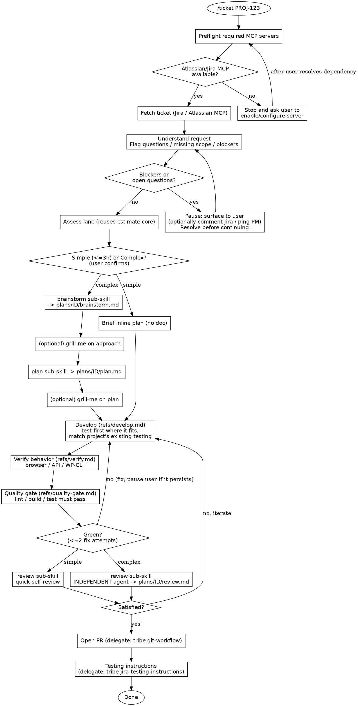

# Ticket workflow decision tree

The orchestrator (`skills/ticket`) is the only place stage order lives. Simple
tickets (<=3h) take a lighter path; complex tickets get brainstorming, a written
plan, subagent-driven development, and an independent review.

## Lane differences at a glance

| Stage        | Simple (<=3h)                | Complex                                  |
|--------------|------------------------------|------------------------------------------|
| Brainstorm   | skipped                      | `brainstorm.md`, optional grill-me       |
| Plan         | brief inline plan            | `plan.md` with discrete tasks            |
| Develop      | dedicated Sonnet developer subagent | subagent per task, review checkpoint |
| Quality gate | lint/build/test green (≤2 fix attempts, else pause) | same |
| Review       | self-review (escalates to independent agent if risk grows) | independent review agent → `review.md` |
| PR + testing | always (delegated to tribe)  | always (delegated to tribe)              |

The initial Jira dependency is checked before fetching any ticket. Other MCP-backed
dependencies are checked at the start of the stage that needs them and block that
stage when unavailable.

Complex-lane tickets can also pause and resume across sessions at a few points (after
plan approval, between develop task-checkpoints, before review, before PR) — see
`checkpoints.md`. `/ticket <ID>` checks for a `plans/<TICKET-ID>/status.md` resume cursor
before fetching from Jira.
